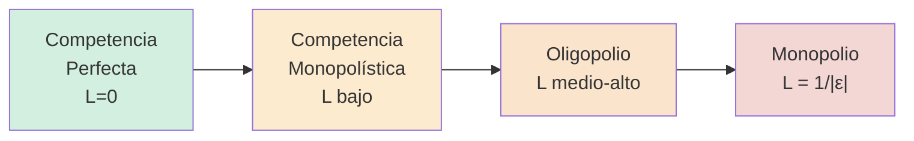

## Definición

**Estructura de mercado:** clasificación de los mercados según el número de empresas, el grado de diferenciación del producto, las barreras a la entrada y el poder de mercado de cada firma. Se ordena en un **espectro** que va desde competencia perfecta (muchas firmas, sin poder) hasta monopolio (una sola firma, poder total).

## Espectro

## Tabla comparativa

| Estructura | Nº empresas | Producto | Barreras entrada | Poder de mercado | $P$ vs $CMg$ |
|---|---|---|---|---|---|
| **Competencia perfecta** | Muchísimas | Homogéneo | Ninguna | Nulo | $P = CMg$ |
| **Competencia monopolística** | Muchas | Diferenciado | Bajas | Bajo | $P > CMg$ |
| **Oligopolio** | Pocas | Homogéneo o diferenciado | Altas | Alto | $P > CMg$ |
| **Monopolio** | Una | Sin sustitutos | Muy altas | Total | $P \gg CMg$ |

## Intuición / Por qué importa

El espectro permite **predecir comportamiento y bienestar** sin re-derivar todo desde cero. La competencia perfecta es el benchmark de eficiencia ($W = EC + EP$ máximo). Cualquier estructura imperfecta produce un apartamiento: precio mayor, cantidad menor, [[deadweight-loss|DWL]] positivo. El [[indice-lerner|Índice de Lerner]] $L = (P-CMg)/P$ cuantifica dónde cae cada estructura.

## Ejemplo

- **CP:** mercado mayorista de soja en Rosario.
- **Comp. monopolística:** restaurantes de Palermo.
- **Oligopolio:** telefonía celular en Argentina (Claro, Movistar, Personal).
- **Monopolio:** distribución eléctrica domiciliaria por zona (Edenor / Edesur).

## Errores comunes / Distinciones

- **No confundir "pocas firmas" con monopolio:** dos o tres firmas son oligopolio, no monopolio.
- **Comp. monopolística ≠ monopolio:** muchas firmas con productos diferenciados, no una sola.
- **El número solo no define la estructura:** importa la diferenciación, las barreras y la estrategia de las firmas.

## Relacionado con
- [[competencia-perfecta-caracteristicas]]
- [[monopolio]]
- [[competencia-monopolistica]]
- [[oligopolio]]
- [[indice-lerner]]
