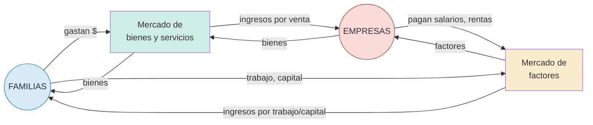

## Definición

El **flujo circular** es un modelo simplificado que muestra cómo se vinculan **familias** y **empresas** a través de **dos mercados**:

- **Mercado de bienes y servicios:** las empresas venden, las familias compran. Los pesos van de familias a empresas; los bienes en sentido inverso.
- **Mercado de factores:** las familias venden trabajo y capital, las empresas compran. Los pesos (salarios, rentas, alquileres) van de empresas a familias; los factores en sentido inverso.

## Esquema

## Intuición / Por qué importa

Modela una **economía cerrada y simplificada** donde todo lo que las empresas pagan a familias se convierte en gasto que vuelve a las empresas. Es la base intuitiva para las **identidades macroeconómicas** de la Unidad 5 (PBI por enfoque del gasto vs. del ingreso vs. del producto), porque los tres enfoques miden el mismo flujo desde puntos distintos.

## Ejemplo

Una empresa paga \$1000 en salarios. Las familias usan ese ingreso para comprar bienes por \$1000. Esos \$1000 vuelven a las empresas como ingreso. El círculo se cierra.

Si se introduce **Estado**: agrega impuestos (familias y empresas pagan) y gasto público (vuelve a familias y empresas).

## Errores comunes / Distinciones

- El modelo simple ignora ahorro, inversión, gobierno y sector externo — esos se agregan en macro.
- Los flujos monetarios y reales van en **direcciones opuestas**: si los pesos van hacia las empresas, los bienes van hacia las familias.
- No confundir "mercado de factores" con "mercado financiero": los factores son trabajo y capital físico/humano, no dinero.

## Relacionado con
- [[microeconomia-macroeconomia]]
- [[economia]]
- [[oferta-demanda]]
