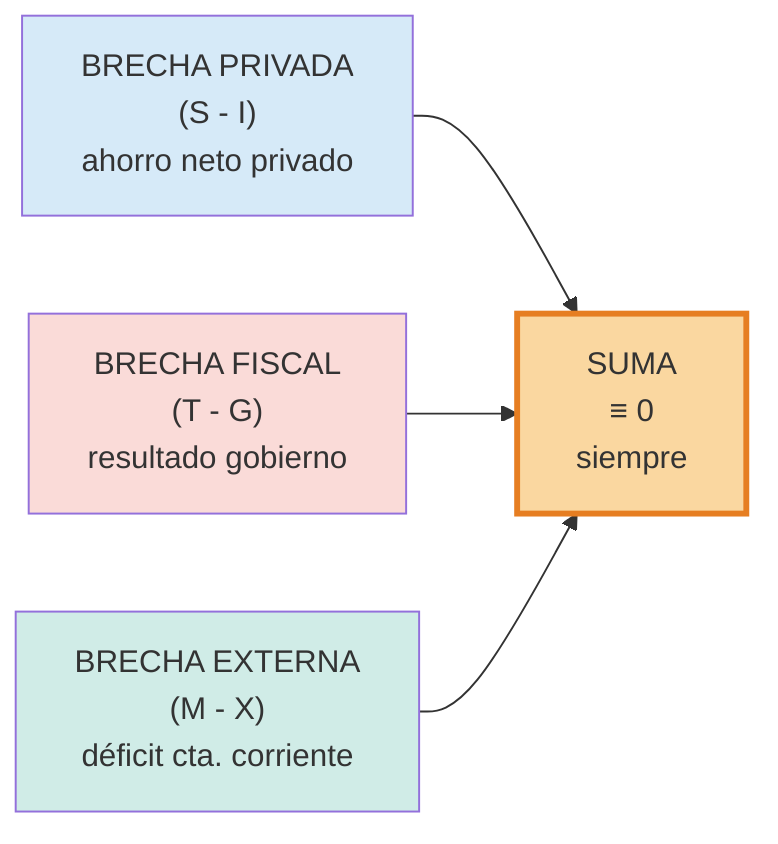

## Definición

**Identidad fundamental del Sistema de Cuentas Nacionales:** los usos del ingreso (consumir, ahorrar, pagar impuestos) deben igualar la composición del producto por destino del gasto. Reordenando, se obtiene el **modelo de tres brechas**:

$$C + S + T \equiv Y \equiv C + I + G + (X - M)$$

Donde:
- $Y$: ingreso / producto nacional
- $C$: consumo privado
- $S$: ahorro privado
- $T$: impuestos netos
- $I$: inversión bruta
- $G$: gasto público
- $X$: exportaciones
- $M$: importaciones

$$\boxed{(S - I) + (T - G) + (M - X) \equiv 0}$$

## Las tres brechas

- **$(S - I)$ — brecha privada:** ahorro privado menos inversión. Si es positiva, el sector privado es ahorrador neto.
- **$(T - G)$ — brecha fiscal:** resultado del gobierno. Si es negativa, hay déficit fiscal.
- **$(M - X)$ — brecha externa (signo invertido):** equivale a $-(X-M)$. Si es positiva (importamos más que exportamos), hay déficit en cuenta corriente.

## Intuición / Por qué importa

Es una **identidad contable**, no una relación causal: se cumple **siempre**, por construcción. Indica que los excesos y déficits sectoriales se compensan entre sí. Si el gobierno tiene déficit, **alguien lo tiene que financiar**: o exceso de ahorro privado, o endeudamiento externo (déficit en cuenta corriente). Aritméticamente imposible que un país tenga simultáneamente déficit fiscal grande, baja inversión privada y superávit externo.

## Ejemplo

Argentina hipotética: déficit fiscal $T - G = -3\%$ del PBI. Si la cuenta corriente es deficitaria $(M - X) = +2\%$, entonces el sector privado debe estar ahorrando $S - I = +1\%$ para que cuadre.

$$1\% + (-3\%) + 2\% = 0 \quad ✓$$

## Errores comunes / Distinciones

- **No es una teoría — es identidad.** Vale en cualquier régimen.
- **El signo de $(M-X)$ es el opuesto del de exportaciones netas.** En la identidad aparece $(M-X)$, no $(X-M)$.
- **No implica causalidad.** El déficit fiscal *puede* causar déficit externo (gemelos), pero la identidad por sí sola no lo prueba.

## Relacionado con
- [[pbi]]
- [[deficit-fiscal]]
- [[balanza-comercial]]
- [[cuenta-corriente]]
