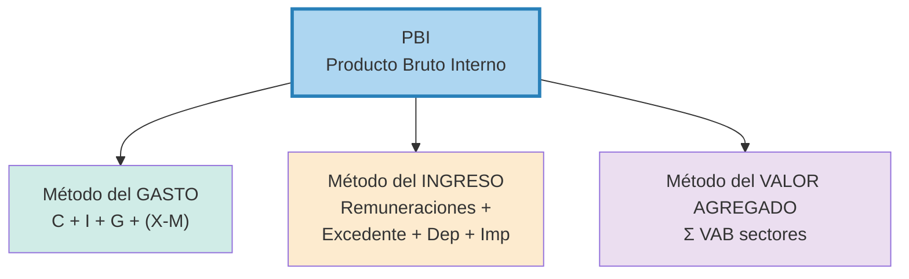

## Definición

**Producto Bruto Interno (PBI):** valor monetario de **todos los bienes y servicios finales** producidos **dentro de las fronteras** de un país en un período (típicamente trimestral o anual). Es el indicador agregado central de la macroeconomía.

## Cuatro distinciones que hay que saber

| Distinción | Significado |
|---|---|
| **Bienes finales** vs intermedios | Solo los finales; los insumos ya están incorporados en el precio del producto final (evita doble contabilización) |
| **Bruto** vs Neto | Bruto incluye depreciación; Neto la descuenta |
| **Interno** (PBI) vs Nacional (PNB) | PBI: lo producido dentro del país (sin importar nacionalidad); PNB: lo producido por residentes (dentro o fuera) |
| **Nominal** vs Real | Nominal a precios corrientes; Real a precios de un año base |

## Tres métodos de cálculo (deben dar lo mismo)

1. **Gasto:** $PBI = C + I + G + (X - M)$

   Donde:
   - $C$: consumo privado
   - $I$: inversión bruta
   - $G$: gasto público
   - $X$: exportaciones
   - $M$: importaciones

2. **Ingreso:** Remuneraciones + Excedente de explotación + Depreciación + Impuestos netos
3. **Valor agregado:** $\sum VAB$ de cada sector productivo, donde $VAB$ = output del sector menos consumo intermedio.

## Intuición / Por qué importa

El PBI mide el "tamaño" de la economía. Su tasa de crecimiento real define si hay expansión o recesión. Es la variable de referencia para política fiscal/monetaria, comparaciones internacionales y bienestar agregado (con muchas limitaciones — no mide distribución, informalidad ni externalidades).

## Ejemplo

Argentina 2024 (datos aprox.): $C \approx 70\%$ del PBI, $I \approx 18\%$, $G \approx 18\%$, $X-M \approx -6\%$ → suma 100%.

## Errores comunes / Distinciones

- **Sumar bienes intermedios.** El trigo del molinero ya está en el precio del pan.
- **Confundir PBI con PNB.** En Argentina el PNB suele ser menor que el PBI (renta neta del exterior negativa).
- **Mezclar nominal y real.** Para comparar entre años hay que deflactar.

## Relacionado con
- [[pbi-nominal-vs-real]]
- [[deflactor]]
- [[valor-agregado]]
- [[identidad-sectorial]]
- [[ciclo-economico]]
