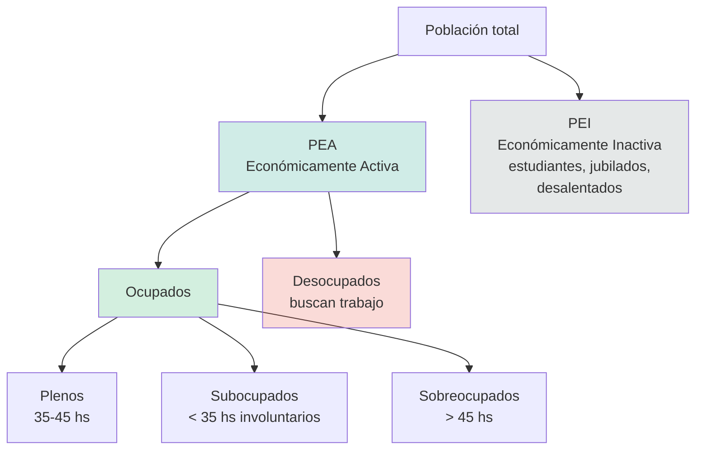

## Definición

Estructura conceptual del **mercado de trabajo**:

- **Población total** = PEA + PEI
- **PEA (Población Económicamente Activa)** = Ocupados + Desocupados (los que trabajan o buscan trabajo).
- **PEI (Población Económicamente Inactiva)** = los que ni trabajan ni buscan: estudiantes, jubilados, amas de casa, **desalentados** (que dejaron de buscar).

**Subdivisión de Ocupados:**
- **Plenos:** 35–45 hs semanales.
- **Subocupados:** menos de 35 hs **involuntariamente** (querrían trabajar más).
- **Sobreocupados:** más de 45 hs.

## Fórmulas (ojo con los denominadores)

$$\text{Tasa de actividad} = \frac{PEA}{Población}$$

$$\text{Tasa de ocupación} = \frac{Ocupados}{Población}$$

$$\text{Tasa de desocupación} = \frac{Desocupados}{PEA}$$

$$\text{Tasa de demandantes} = \frac{Desocupados + Subocupados}{PEA}$$

Donde:
- $PEA$: Población Económicamente Activa (Ocupados + Desocupados)
- $Población$: población total relevada
- $Ocupados$: personas con empleo (plenos + subocupados + sobreocupados)
- $Desocupados$: personas sin trabajo que lo buscan activamente
- $Subocupados$: ocupados con menos de 35 hs semanales involuntariamente

## Intuición / Por qué importa

Los denominadores **no son los mismos** — la tasa de desocupación se calcula sobre la **PEA**, no sobre la población total. Esto explica por qué un retiro masivo del mercado laboral (volverse "desalentado") puede **bajar** la tasa de desocupación sin que la economía mejore.

## Ejemplo

Población total = 1.000. PEI = 400 → PEA = 600. Ocupados = 540, Desocupados = 60.
- Actividad: 600/1000 = 60%
- Ocupación: 540/1000 = 54%
- Desocupación: 60/600 = 10%

Si 30 desocupados se desalientan (pasan a PEI): nueva PEA = 570, Desocupados = 30, **Desocupación = 30/570 = 5,3%**. La tasa baja, pero la economía no mejoró.

## Errores comunes / Distinciones

- **No mezclar tasa de actividad con tasa de ocupación.** Ambas tienen Población como denominador, pero el numerador es PEA o solo Ocupados.
- **El desocupado tiene que estar buscando activamente.** Si dejó de buscar es PEI (desalentado), no desocupado.
- **Subocupado ≠ desocupado.** Subocupado es ocupado pero con menos horas de las que querría.

## Relacionado con
- [[tipos-desempleo]]
- [[tasa-natural-desempleo]]
- [[ley-okun]]
