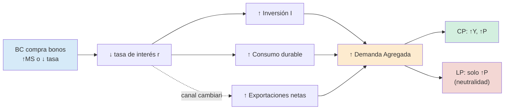

## Definición

**Política monetaria:** acción del Banco Central para **controlar la cantidad de dinero** y, vía la tasa de interés, **influir sobre la actividad económica y los precios**.

## Tipos

| Tipo | Acción | Mecanismo | Cuándo usar |
|---|---|---|---|
| **Expansiva** | ↑ $MS$ o ↓ tasa de política | ↓ $r$ → ↑$I$, ↑$C$ durable → DA derecha → ↑$Y$, ↑$P$ | Recesión / brecha recesiva |
| **Contractiva** | ↓ $MS$ o ↑ tasa | ↑ $r$ → ↓$I$, ↓$C$ → DA izquierda → ↓$Y$, ↓$P$ | Sobrecalentamiento / inflación alta |

## Mecanismo de transmisión (caso expansivo)

1. BC compra bonos (OMA) o baja la tasa de política.
2. Aumenta la oferta monetaria $MS$ → exceso de oferta en el mercado de dinero.
3. Cae la tasa de interés $r$.
4. Cae el costo del crédito → ↑ inversión $I$ y consumo durable.
5. Posible canal cambiario: ↓ $r$ → fuga de capitales → ↑ tipo de cambio → ↑ exportaciones netas.
6. Aumenta la **DA**.
7. En el corto plazo: ↑ $Y$ y ↑ $P$ (porque OACP tiene pendiente positiva).
8. En el **largo plazo**: solo ↑ $P$ (OALP vertical → neutralidad del dinero).

## Lags

- **Lag de reconocimiento:** detectar el problema (datos disponibles con retraso).
- **Lag de implementación:** muy corto en política monetaria (BC decide rápido).
- **Lag de efecto:** 6 a 18 meses para que impacte plenamente.

## Intuición / Por qué importa

Es el principal instrumento moderno de **estabilización del ciclo**. A diferencia de la política fiscal:
- **Más rápida de implementar** (no requiere ley del Congreso).
- **Más reversible** (subir y bajar tasas).
- **Menos sujeta a presiones políticas** (si el BC es independiente).

Pero tiene **límites**:
- En el **Zero Lower Bound (ZLB)** la tasa nominal no puede bajar de 0 — la herramienta tradicional se agota.
- En **alta inflación**, los aumentos de $MS$ se trasladan rápido a precios sin afectar producto.
- **Dominancia fiscal:** si el BC debe financiar el déficit, pierde efectividad.

## Ejemplo

EE.UU. 2020 (COVID): la Fed bajó tasas a 0–0,25% y lanzó QE → política monetaria fuertemente expansiva → ayudó a sostener DA. Combinado con expansión fiscal evitó depresión.

EE.UU. 2022-23 (inflación post-COVID): la Fed subió tasas de 0 a 5,5% en 18 meses → política contractiva → enfrió la economía y la inflación bajó de 9% a 3%.

## Errores comunes / Distinciones

- **No es neutral en el corto plazo** (tiene efectos reales) pero **sí en el largo plazo**.
- **Política monetaria ≠ cambiaria.** Aunque en algunos regímenes están entrelazadas (caja de conversión, convertibilidad).
- **Bajar la tasa nominal cuando $r$ ya es negativa en términos reales no estimula tanto** — depende de la tasa **real**.

## Gráfico

![[politica-monetaria-expansiva.svg]]
## Relacionado con
- [[mercado-dinero]]
- [[demanda-agregada]]
- [[banco-central-herramientas]]
- [[regimen-politica-monetaria]]
- [[neutralidad-dinero]]
- [[instrumentos-no-convencionales]]
