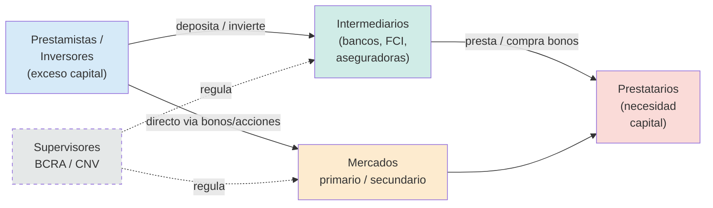

## Definición

**Sistema financiero:** conjunto de **instituciones, instrumentos y mercados** que conecta agentes con **exceso de capital** (ahorristas, inversores) con agentes con **necesidad de capital** (empresas, gobiernos, hogares).

## Componentes

| Categoría | Ejemplos |
|---|---|
| **Prestamistas/Inversores** | hogares con ahorros, fondos de pensión, aseguradoras |
| **Intermediarios** | bancos, sociedades de bolsa, fondos comunes |
| **Instrumentos** | bonos, acciones, depósitos, fideicomisos |
| **Mercados** | primario (emisión) y secundario (compraventa) |
| **Supervisores** | BCRA, CNV (Argentina) |
| **Prestatarios** | empresas, gobiernos, hogares |

## Funciones (rol macroeconómico)

1. **Canalizar el ahorro hacia la inversión** productiva.
2. **Agregar capital:** suma muchos pequeños ahorros para financiar grandes proyectos.
3. **Selección de proyectos** con mejor relación riesgo-retorno.
4. **Diversificación de riesgos:** distribuye el riesgo entre muchos.
5. **Monitoreo de riesgos** y de prestatarios.

## Intuición / Por qué importa

Sistemas financieros **más profundos y desarrollados** se asocian empíricamente a **mayor crecimiento económico**: hay más crédito para inversión, mejor selección de proyectos, mayor liquidez. La **profundidad financiera** se mide típicamente como crédito privado / PBI o capitalización bursátil / PBI.

## Indicadores: Argentina vs el mundo

| Indicador | Argentina (~2024) | LatAm | Desarrollados |
|---|---|---|---|
| Crédito privado / PBI | ~12,8% | ~41% | ~131% |
| Depósitos / PBI | bajo | medio | alto |
| Capitalización bursátil / PBI | bajo | medio | muy alto |

Argentina tiene un sistema **atípicamente pequeño**, dominado por **títulos públicos** y con poca financiación al sector privado. Causas: inflación crónica, defaults, desconfianza, dolarización.

## Ejemplo

Si una empresa quiere construir una fábrica de $100M$, no necesita encontrar UNA persona que le preste $100M$. El sistema financiero junta los ahorros de miles de personas (vía bonos, depósitos bancarios), los selecciona y se los presta. Sin sistema financiero, la inversión sería imposible.

## Errores comunes / Distinciones

- **No es solo el sistema bancario.** Incluye mercado de capitales, fondos, aseguradoras, etc.
- **Profundidad ≠ calidad.** Un sistema grande puede estar mal regulado (crisis 2008).
- **El BC no presta directamente al sector privado.** Es prestamista de última instancia para bancos.

## Relacionado con
- [[tasa-interes]]
- [[bonos-renta-fija]]
- [[acciones-renta-variable]]
- [[banco-central-herramientas]]
- [[rating-crediticio]]
