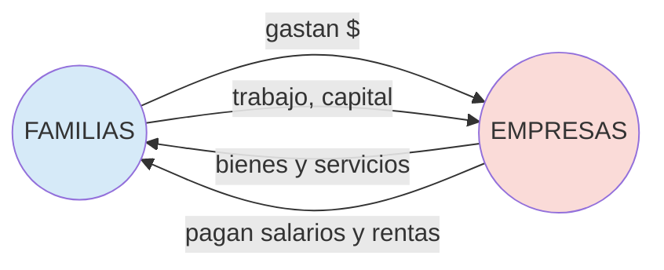

## Resumen

### El problema económico

La economía es la ciencia social que estudia cómo las sociedades **administran recursos escasos** para satisfacer necesidades ilimitadas. Este desfasaje es el fundamento de todo el análisis: si los recursos fueran abundantes no habría que elegir, y la economía no existiría como disciplina. La **[[escasez]]** obliga a tomar decisiones, y toda decisión implica renunciar a una alternativa. Ese valor renunciado se llama **[[costo-de-oportunidad]]** y es el costo "verdadero" desde la mirada económica — no el desembolso monetario sino lo *mejor que se dejó de hacer*.

La **[[frontera-posibilidades-produccion|Frontera de Posibilidades de Producción (FPP)]]** formaliza este trade-off a nivel agregado: combina los puntos eficientes en los que una economía produce el máximo de un bien dado lo que produce del otro. Los puntos *sobre* la curva son eficientes; los puntos *adentro* son técnicamente factibles pero ineficientes (recursos ociosos); los puntos *afuera* son inalcanzables con la tecnología actual. La **forma cóncava** de la FPP refleja costos de oportunidad **crecientes**: cuanto más se especializa la economía en un bien, más caro (en términos del otro bien) es seguir aumentando esa producción, porque los recursos no son perfectamente intercambiables entre usos.

![[fpp.svg]]

La unidad introduce dos niveles de análisis: la **[[microeconomia-macroeconomia|microeconomía]]** estudia decisiones individuales (consumidores, empresas) y mercados particulares; la **macroeconomía** estudia agregados (PBI, inflación, desempleo). Toda esta unidad — y las tres siguientes — son **microeconomía**.

### Principios metodológicos

Tres ideas atraviesan toda la materia:

1. **[[analisis-marginal|Análisis marginal]]:** las decisiones racionales se toman en el margen. Un agente sigue actuando mientras el **beneficio marginal** (lo que gana por la última unidad) supere al **costo marginal** (lo que cuesta esa unidad). Óptimo: $BMg = CMg$. Esta regla se replica en producción ($IMg = CMg$), consumo (utilidad marginal por peso) e impuestos (incidencia óptima).
2. **Los incentivos importan:** los precios son señales que coordinan decisiones descentralizadas — Adam Smith, "mano invisible".
3. **[[flujo-circular|Flujo circular]]:** familias y empresas se vinculan por dos mercados. En el **mercado de bienes y servicios** las empresas venden, las familias compran (los pesos van de familias a empresas). En el **mercado de factores** las familias venden trabajo y capital, las empresas pagan salarios y rentas. Es una contabilidad cerrada que prefigura las identidades macroeconómicas de la Unidad 5.

### El mercado: oferta y demanda

El mercado es el mecanismo de asignación dominante en una economía descentralizada. Se modela mediante **[[oferta-demanda|curvas de oferta y demanda]]** que relacionan precio con cantidad bajo el supuesto *ceteris paribus* (todo lo demás constante).

- **Demanda:** pendiente negativa (ley de la demanda — al subir P baja Q demandada). Sus determinantes *no* incluidos en el eje son: ingreso, precio de bienes relacionados ([[bienes-sustitutos-complementarios|sustitutos/complementarios]]), gustos, expectativas, número de compradores. Un cambio en el precio mueve *sobre* la curva; un cambio en otro determinante **desplaza** toda la curva.
- **Oferta:** pendiente positiva (ley de la oferta). Determinantes externos: precios de insumos, tecnología, expectativas, número de oferentes, impuestos.

La distinción **[[desplazamientos-curvas|"movimiento sobre" vs "desplazamiento de" la curva]]** es uno de los errores conceptuales más penalizados en los parciales: si cambia *el precio del bien*, hay movimiento sobre la curva; si cambia *cualquier otro determinante*, la curva se desplaza.

El **precio cumple dos funciones simultáneas**:
- **Racionar:** decide quiénes obtienen el bien (los que estén dispuestos a pagarlo).
- **Asignar:** orienta los recursos hacia los usos más valorados (precios altos atraen producción).

El **[[equilibrio-mercado|equilibrio de mercado]]** se da donde $Q_d(P) = Q_s(P)$.

Donde:
- $P$: precio del bien
- $Q_d(P)$: cantidad demandada en función del precio
- $Q_s(P)$: cantidad ofrecida en función del precio
- $P^*$: precio de equilibrio (donde $Q_d = Q_s$)

Si $P > P^*$ → exceso de oferta (los oferentes bajan precio). Si $P < P^*$ → exceso de demanda (la presión empuja precio hacia arriba). Es un equilibrio **estable**: shocks sobre P se corrigen automáticamente.

![[oferta-demanda-equilibrio.svg]]

La distinción **movimiento sobre la curva vs desplazamiento de la curva** es el error más penalizado en parciales:

![[desplazamientos-curva.svg]]

El **[[excedente-consumidor]]** mide el bienestar del comprador (lo que estaba dispuesto a pagar menos lo que pagó), y será central en el análisis de bienestar de las Unidades 3 y 4.

![[excedente-consumidor-productor.svg]]

### Elasticidades

Las **[[elasticidad|elasticidades]]** son medidas adimensionales de **sensibilidad porcentual**: cuánto varía Q (en %) ante un cambio de 1% en alguno de sus determinantes. Existen cuatro variantes operativas:

| Elasticidad | Fórmula | Mide | Clasificación |
|---|---|---|---|
| **Precio de demanda** ($\eta$) | $\dfrac{\%\Delta Q_d}{\%\Delta P}$ | Reacción de Q ante P | $\|\eta\|>1$ elástica · $\|\eta\|<1$ inelástica · $\|\eta\|=1$ unitaria |
| **Precio de oferta** ($\varepsilon_p$) | $\dfrac{\%\Delta Q_s}{\%\Delta P}$ | Reacción de oferta | igual criterio |
| **[[elasticidad-ingreso\|Ingreso]]** ($\varepsilon_Y$) | $\dfrac{\%\Delta Q}{\%\Delta Y}$ | Reacción al ingreso | $>1$ lujo · $0{<}\varepsilon_Y{<}1$ básico · $<0$ inferior |
| **[[elasticidad-cruzada\|Cruzada]]** ($\varepsilon_{XY}$) | $\dfrac{\%\Delta Q_X}{\%\Delta P_Y}$ | Relación entre bienes | $>0$ sustitutos · $<0$ complementarios |

Donde:
- $\eta$: elasticidad-precio de la demanda (adimensional)
- $\varepsilon_p$: elasticidad-precio de la oferta
- $\varepsilon_Y$: elasticidad-ingreso de la demanda
- $\varepsilon_{XY}$: elasticidad cruzada (efecto del precio de Y sobre la demanda de X)
- $Y$: ingreso del consumidor
- $Q_X, P_Y$: cantidad demandada de X, precio del bien Y

Determinantes de la elasticidad-precio: existencia y cercanía de **sustitutos** (más sustitutos → más elástica), peso del bien en el presupuesto, plazo (largo plazo más elástica que corto plazo), bien de lujo vs necesidad.

![[elasticidades-comparacion.svg]]

**Aplicación clave — gasto total:** $G = P \cdot Q$. Si la demanda es **elástica**, una baja de precio aumenta el gasto total (Q crece más que P baja). Si es **inelástica**, una baja de precio reduce el gasto. Por eso los productores de bienes con demanda inelástica (alimentos básicos, combustibles) prefieren reducir oferta para subir precios — y por eso los cárteles funcionan mejor en mercados inelásticos.

**Tabla de clase ($Q = 8000 - 1000P$, demanda lineal):**

| $P$ | $Q$ | $\|\eta\|$ | Gasto |
|---|---|---|---|
| 8 | 0 | — | 0 |
| 7 | 1.000 | 7,00 | 7.000 |
| 6 | 2.000 | 3,00 | 12.000 |
| 5 | 3.000 | 1,67 | 15.000 |
| 4 | 4.000 | **1,00** | **16.000** ← máx |
| 3 | 5.000 | 0,60 | 15.000 |
| 2 | 6.000 | 0,33 | 12.000 |
| 1 | 7.000 | 0,14 | 7.000 |

Observación clave: el gasto se maximiza exactamente donde $|\eta| = 1$ (punto medio de la demanda lineal). En el tramo elástico (P alto) bajar precio sube el gasto; en el tramo inelástico (P bajo) bajar precio reduce el gasto.

**Determinantes de la elasticidad-precio:**
1. **Existencia y cercanía de sustitutos** — más sustitutos, más elástica.
2. **Necesidad vs lujo** — necesidades inelásticas, lujos elásticos.
3. **Definición del mercado** — más estrecho, más elástica (la demanda de "Pepsi" es más elástica que la de "gaseosas en general").
4. **Proporción del gasto** — bienes que pesan mucho en el presupuesto (auto, vivienda) son más elásticos.
5. **Horizonte temporal** — más largo plazo, más elástica (hay tiempo para sustituir).

### Intervenciones del Estado: controles de precios

Los **[[controles-de-precios]]** son una herramienta política que ilustra los costos de "saltearse" el mercado:

- **Precio máximo** (techo, debe ser $< P^*$ para ser activo): genera **escasez** (Qd > Qs). Ejemplos: alquileres regulados, naftas. Resultado predecible: colas, mercado negro, reducción de calidad.

![[precio-maximo.svg]]

- **Precio mínimo** (piso, debe ser $> P^*$): genera **excedente** (Qs > Qd). Ejemplos: salario mínimo (excedente = desempleo), precio sostén agrícola.

![[precio-minimo.svg]]

En ambos casos hay **pérdida de eficiencia** ([[deadweight-loss|DWL]]) y la incidencia depende de las elasticidades. Estas distorsiones serán reanalizadas con impuestos en la Unidad 3.

## Conceptos clave

### Introducción
- [[economia]] — definición, problemas fundamentales (qué/cómo/para quién producir)
- [[escasez]] — fundamento de la economía
- [[costo-de-oportunidad]] — valor de la alternativa renunciada
- [[microeconomia-macroeconomia]] — niveles de análisis
- [[frontera-posibilidades-produccion]] — modelo FPP, eficiencia, costos crecientes
- [[analisis-marginal]] — regla de decisión racional ($BMg \gtrless CMg$)
- [[flujo-circular]] — modelo familias-empresas (mercados de bienes y de factores)

### Oferta, demanda y mercado
- [[oferta-demanda]] — leyes, determinantes, curvas
- [[equilibrio-mercado]] — exceso de demanda/oferta, ajuste dinámico
- [[desplazamientos-curvas]] — movimiento sobre vs desplazamiento de la curva
- [[bienes-sustitutos-complementarios]]
- [[bienes-normales-inferiores]]
- [[excedente-consumidor]]

### Elasticidades
- [[elasticidad]] — concepto general (sensibilidad porcentual)
- [[elasticidad-precio-demanda]] — η, determinantes, gasto total
- [[elasticidad-precio-oferta]] — ε, papel del plazo
- [[elasticidad-ingreso]] — clasifica bienes (lujo/básico/inferior)
- [[elasticidad-cruzada]] — clasifica sustitutos/complementarios

### Intervenciones
- [[controles-de-precios]] — precio máximo (escasez), precio mínimo (excedente)

## Fórmulas principales

Ver [[formulas/unidad-01]]. Imprescindibles:
- Equilibrio: $Q_d(P) = Q_s(P)$
- Elasticidad-precio: $\eta = \dfrac{\partial Q}{\partial P} \cdot \dfrac{P}{Q}$
- Excedente del consumidor (demanda lineal): triángulo bajo $D$ por encima de $P^*$

## Ejercicios

- [[ejercicios/gp1-microeconomia]] — 11 ejercicios: oferta/demanda, elasticidades, controles de precios

## Conexiones

- **[[unidades/unidad-02-produccion-y-costos]]:** la curva de oferta deriva del análisis de producción y costos; específicamente, la oferta de la empresa es el tramo de $CMg$ por encima del mínimo del $CVMe$.
- **[[unidades/unidad-03-mercados-competencia-perfecta]]:** profundiza el equilibrio de mercado para una estructura específica (CP) y vuelve sobre elasticidades en el contexto de incidencia impositiva.
- **[[unidades/unidad-04-mercados-imperfectos]]:** la elasticidad determina el margen del monopolista (Índice de Lerner $L = 1/|\eta|$).
- **[[unidades/unidad-05-macroeconomia]]:** oferta y demanda *agregadas* usan lógica análoga a nivel macro; el flujo circular se generaliza en las identidades del SCN.

## Errores comunes (mirar antes del parcial)

1. **Confundir movimiento sobre la curva con desplazamiento.** Si cambia $P$ → mismo punto en otra cantidad sobre la misma curva. Si cambia ingreso, gusto, precio de un sustituto → curva entera se desplaza.
2. **Calcular elasticidad como $\Delta Q / \Delta P$ sin escalar.** Recordar: es porcentual, lleva $P/Q$.
3. **Olvidar el signo en elasticidad-precio.** Estrictamente $\eta < 0$ por la ley de demanda. Se trabaja con valor absoluto, pero al clasificar (elástica/inelástica) se mira $|\eta|$.
4. **Tratar "elástica" como sinónimo de "alta demanda".** Elasticidad mide *sensibilidad*, no *nivel*.
5. **Asumir que precio máximo siempre baja el precio.** Solo es activo si está por debajo de $P^*$; si está por encima no genera distorsión.
6. **Ignorar el efecto de la elasticidad en la incidencia.** El que no puede irse del mercado (más inelástico) es el que carga el impuesto.

## Temas sensibles para Parcial 1

- Cálculo de equilibrio dados $Q_d$ y $Q_s$ lineales (sistema 2×2).
- Cálculo e interpretación de elasticidades en un punto, y predicción del efecto sobre el gasto total.
- Efectos de precio máximo/mínimo: identificar exceso, calcular su tamaño.
- Distinguir desplazamientos vs movimientos sobre la curva — explicar la causa (qué determinante cambió).
- Clasificar bienes por elasticidad-ingreso y cruzada.
- Calcular excedente del consumidor antes y después de un shock.
