# Notion Teoricas PAW — Apuntes en vivo

**Archivo original:** `raw/assets/NotionPAW.pdf` (36 páginas, exportado de Notion)
**Imágenes extraídas:** `raw/assets/notion-paw-images/img-000.png` ... `img-070.png` (71 screenshots)

Apuntes manuales tomados en clase a lo largo del cuatrimestre, alternados con resúmenes generados con Claude. Estructurados por fecha de clase. Tres bloques principales:

1. **Lun 8/04** — Spring Security & Logging (referencia a [[Clase 5 — Spring Security y Logging]])
2. **Lun 13/04** — Logging parte 2 + AOP (referencia a [[Clase 6 — Logging parte 2 y AOP]] y [[Transcripción Clase 13/04 — Logging, AOP y ControllerAdvice]])
3. **Lun 27/04** — **Usos avanzados de Spring Security** + **Introducción a Hibernate & JPA (segunda entrega)** ← contenido nuevo, no estaba en los PDFs anteriores.

Esta página destila el bloque **Lun 27/04** que es el material genuinamente nuevo.

---

## Lun 27/04 — Parte A: Usos avanzados de Spring Security

### Problema

> Existen tantos dueños de publicaciones como usuarios, entonces no podríamos definir roles para eso (serían muchos). Pero por ejemplo **solo yo tengo que poder editar MIS productos**.

Los roles (`ROLE_USER`, `ROLE_ADMIN`) no escalan para checks de **ownership por instancia** — no podés tener un rol por cada usuario.

### Solución: SpEL `access()` con bean propio

En `WebAuthConfig`, una regla en `authorizeRequests()` puede llamar un método de un bean Spring usando la expresión `@beanName.method(...)`:

```java
.antMatchers(HttpMethod.POST, "/profile/{id:\\d+}")
    .access("@userSecurity.hasUserId(authentication, #id)")
.antMatchers("/profile/**").hasRole("USER")
```

- `@userSecurity` referencia al bean `@Component("userSecurity")`.
- `#id` es la `@PathVariable` del request actual.
- `authentication` es el objeto `Authentication` del contexto.
- **El orden importa**: la regla específica del POST con `access(...)` va **antes** que la regla general `/profile/**`.

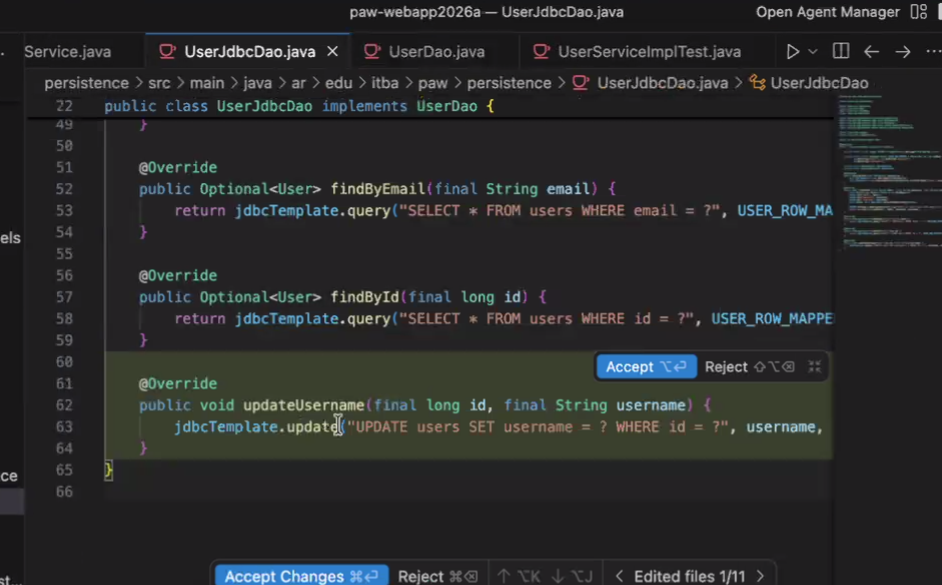

### El bean que decide

```java
@Component("userSecurity")
public class UserSecurity {

    public boolean hasUserId(Authentication authentication, Long userId) {
        if (authentication != null
            && authentication.getPrincipal() instanceof PawAuthUser) {
            PawAuthUser pawAuthUser = (PawAuthUser) authentication.getPrincipal();
            return pawAuthUser.getUser().getId().equals(userId);
        }
        return false;
    }
}
```

- Anotado como `@Component("userSecurity")` para que Spring lo encuentre con ese nombre.
- Chequea: ¿está logueado? + ¿el principal es el usuario que estoy modificando?

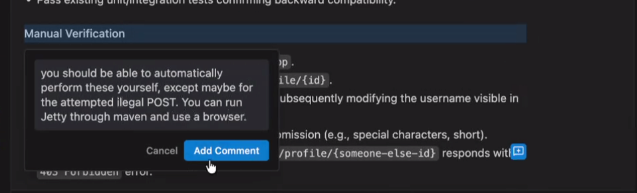

### Refrescar el `SecurityContext` después de cambiar el username

Si el usuario edita su propio username, el `Authentication` cargado en el contexto sigue teniendo el viejo. Para evitar forzar un logout:

```java
@RequestMapping(value = "/profile/{id:[0-9]+}", method = RequestMethod.POST)
public ModelAndView updateProfile(
        @PathVariable("id") final long id,
        @Validated(UserForm.UserValidationUpdate.class) @ModelAttribute("updateUserForm") final UserForm form,
        final BindingResult errors) {
    if (errors.hasErrors()) {
        return profile(id, form);
    }
    userService.updateUsername(id, form.getUsername());

    Authentication auth = SecurityContextHolder.getContext().getAuthentication();
    PawAuthUser oldPrincipal = (PawAuthUser) auth.getPrincipal();
    User updatedUser = userService.findById(id).orElseThrow(EntityNotFoundException::new);
    PawAuthUser newPrincipal = new PawAuthUser(oldPrincipal.getUsername(),
        oldPrincipal.isEnabled(), oldPrincipal.isAccountNonExpired(),
        oldPrincipal.isAccountNonLocked(), oldPrincipal.getAuthorities(), updatedUser);
    Authentication newAuth = new UsernamePasswordAuthenticationToken(newPrincipal, auth.getCredentials());
    SecurityContextHolder.getContext().setAuthentication(newAuth);

    return new ModelAndView("redirect:/profile/" + id);
}
```

> **Nota del apunte:** "eso de la última foto desp lo elimina pq no lo necesita". El profe simplificó a un redirect plano más adelante; el patrón de "rehidratar el principal" queda igual disponible si hace falta.

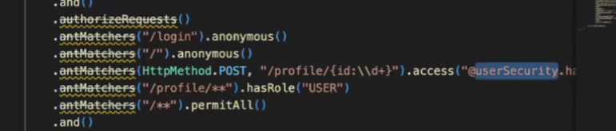

### Validation Groups

Misma form (`UserForm`) reutilizada para registro y para edit, **pero validando subconjuntos distintos**.

```java
public class UserForm {

    public interface UserValidationUpdate { }   // marker interface, sin métodos

    @Size(min = 8, max = 50, groups = {Default.class, UserValidationUpdate.class})
    @Pattern(regexp = "^[a-zA-Z][a-zA-Z0-9]*$",
             message = "{Pattern.userForm.username}")
    private String username;

    @NotEmpty
    @Email
    private String email;     // sólo en Default → no se valida en update

    @Size(min = 8, message = "{Size.userForm.password}")
    private String password;  // sólo en Default → no se valida en update
    // ...
}
```

En el controller:

```java
// Registro: usa @Valid → valida grupo Default
@RequestMapping(value = "/", method = RequestMethod.POST)
public ModelAndView createUser(
        @Valid @ModelAttribute("registerForm") final UserForm form,
        final BindingResult errors) { ... }

// Update: usa @Validated con un grupo específico → sólo username
@RequestMapping(value = "/profile/{id:[0-9]+}", method = RequestMethod.POST)
public ModelAndView updateProfile(
        @PathVariable("id") final long id,
        @Validated(UserForm.UserValidationUpdate.class) @ModelAttribute("updateUserForm") final UserForm form,
        final BindingResult errors) { ... }
```

**Diferencia clave:**

- `@Valid` ↔ `@Validated`: `@Valid` (JSR-303 puro) no soporta groups; `@Validated` (Spring) sí.
- Cada constraint que querés que aplique en el update lleva `groups = {Default.class, UserValidationUpdate.class}`.
- Las constraints sin `groups` por defecto van a `Default.class` y se ignoran cuando llamás con un grupo específico.

> **Comentario del docente** (anotación en el screenshot): "this duplication leads to the need to keep things synchronized moving forward and is brittle. Let's try to use groups to set different validation sets for the existing UserForm."

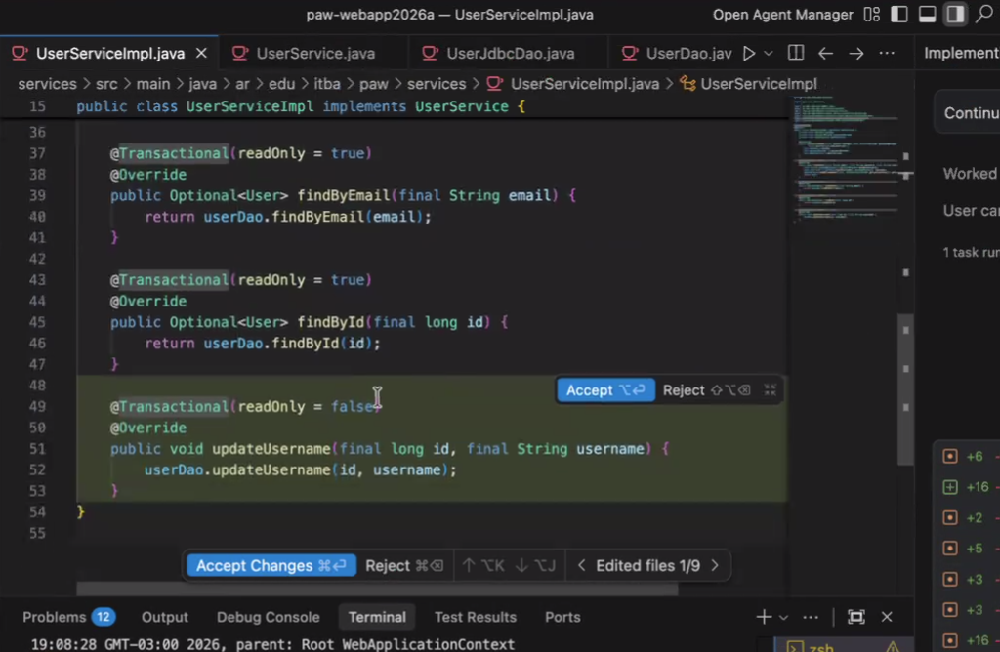

### `ExceptionManagingAdvice`

Concrete del `@ControllerAdvice` para mapeo global de excepciones:

```java
@ControllerAdvice
public class ExceptionManagingAdvice {

    private static final Logger logger = LoggerFactory.getLogger(ExceptionManagingAdvice.class);

    @ExceptionHandler(Exception.class)
    @ResponseStatus(HttpStatus.INTERNAL_SERVER_ERROR)
    public ModelAndView handleException(Exception e) {
        logger.error("Unhandled exception", e);
        return new ModelAndView("error");
    }

    @ExceptionHandler(EntityNotFoundException.class)
    @ResponseStatus(HttpStatus.NOT_FOUND)
    public ModelAndView handleException(EntityNotFoundException e) {
        return new ModelAndView("error");
    }
}
```

> **Nota del apunte:** "Tuvo un problema con la excepción, le faltaba el LOG". El handler del 500 **debe loguear** la excepción — sin eso pierde toda capacidad de debug en prod (la stack trace se traga).

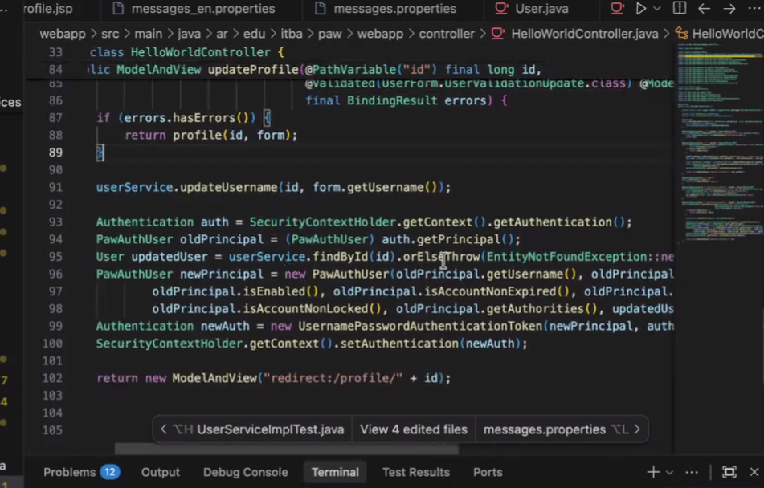

### Tests con `LocaleContextHolder`

```java
@ExtendWith(MockitoExtension.class)
public class UserServiceImplTest {

    @InjectMocks
    private UserServiceImpl userService;

    @Mock
    private UserDao userDao;

    @Mock
    private PasswordEncoder passwordEncoder;

    @Test
    public void testCreateUserWhenUserDoesNotExist() {
        final User user = new User(1L, "test", "encodedPassword", "test");
        Mockito.when(passwordEncoder.encode(Mockito.anyString())).thenReturn("encoded");
        Mockito.when(userDao.createUser(...)).thenReturn(user);
        LocaleContextHolder.setLocale(Locale.ENGLISH);   // ⚠ importante para tests con i18n

        final User result = userService.createUser("test", "test", "test");

        Assertions.assertNotNull(result);
        Assertions.assertEquals(1L, result.getId());
    }
}
```

- **JUnit 5 con `@ExtendWith(MockitoExtension.class)`** confirmado en código real (no más `@RunWith(MockitoJUnitRunner.class)`).
- `LocaleContextHolder.setLocale(...)` es necesario si el service consume `MessageSource` para emails u otros — sino el locale es null y truena.

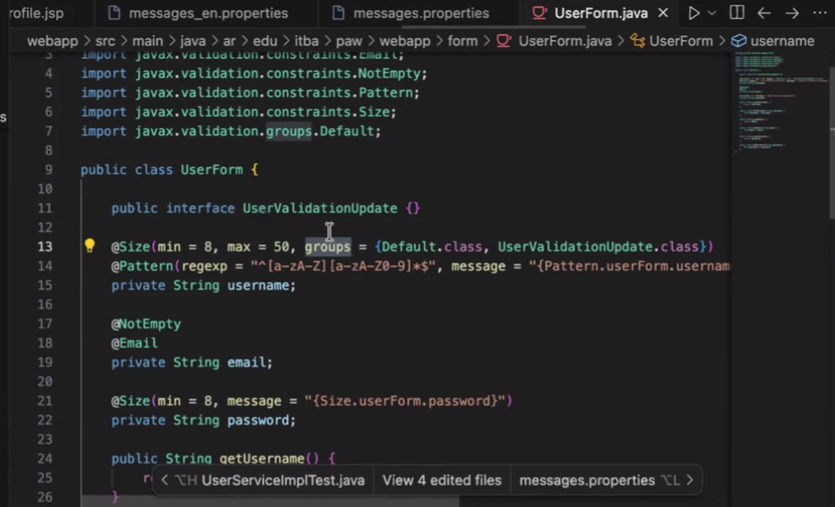

---

## Lun 27/04 — Parte B: Hibernate & JPA (extensiones a la teoría)

> Esto extiende [[Clase 7 — Hibernate y JPA]] y [[Hibernate & JPA]] con material que sólo apareció en la clase en vivo (no está en el PDF de la cátedra).

### Por qué un ORM — el ejemplo Friendship

Relación many-to-many entre usuarios (amigos): en SQL **necesitamos una tabla intermedia** con foreign keys. En el mundo de objetos, esa tabla **no existe** desde la perspectiva de dominio.

Naive (mal): crear `Friendship { Long userId1; Long userId2; }` como entidad de dominio:

> Eso en general no se hace, es un contenedor de otras cosas friendship.

Mejor: en `User` tener una `List<Long> friendIds`. Pero ahí aparecen problemas:

```java
public class User {
    private final Long id;
    private final String email;
    private final String password;
    private final String username;

    private List<Long> friendIds;     // ← acá empieza el problema
    // ...
}
```

#### Problema 1: NULL vs lista vacía

Dos representaciones posibles:

| Representación | Significado en Java |
|---|---|
| `friendIds = null` | "No sé los amigos" |
| `friendIds = Collections.emptyList()` | "Sé que no tiene amigos" |

Cuando lo mapeo a la BD **pierdo información**: no puedo distinguir si era `null` (no cargado) o lista vacía (cargado, sin amigos). Es una **transformación LOSSY** (pierdo data).

#### Problema 2: SQL no es isomórfico al mundo de objetos

| Operación | Java | SQL |
|---|---|---|
| `NULL == NULL` | `true` | `false` (en SQL `NULL = NULL` no devuelve `true`) |
| Significados de NULL | uno solo | varios: "no existe", "no lo conozco", etc. |

Como los paradigmas no son **isomórficos** (no hay función biyectiva entre ellos), **siempre pierdo información**. Tengo que tomar una **convención**: o `null` o lista vacía. Los ORMs imponen la convención por nosotros y garantizan consistencia.

> En general, se prefiere usar **lista vacía** a `null` para evitar `NullPointerException`.

#### Problema 3: ¿Cuándo populo `friendIds`?

Cargarlo siempre que traigo un `User` significa hacer un JOIN o query extra que tal vez no necesito. Los ORMs nos dan **lazy loading**: el atributo se popula sólo cuando se accede.

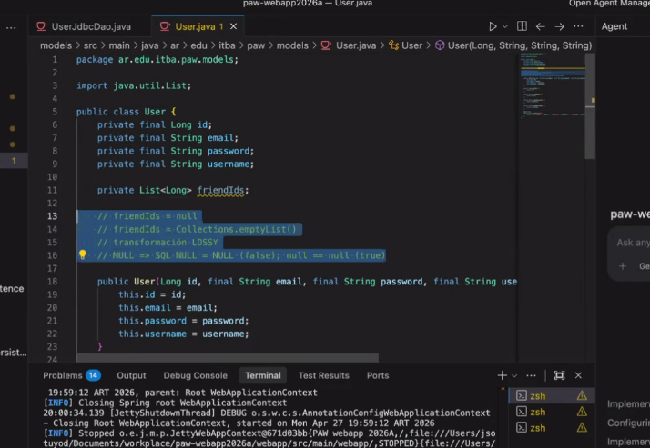

### `EntityManager` es stateful

> EntityManager está asociado a una conexión de base de datos, **tiene estado**. No tengo que tener estado compartido en mis objetos (porque eso no sería thread safe).

**Implicancia**: el `*JpaDao` **NO es singleton**. Spring genera tantas instancias como necesite (request-scoped efectivamente). Es **transparente**: el `UserService` nunca se entera de que hay múltiples instancias del DAO por debajo.

### `em.persist()` — crear vs actualizar

`em.persist(user)` evalúa si la instancia ya tiene un id:

- **Sí tiene id** → hace UPDATE
- **No tiene id** → hace INSERT y le asigna el id de la sequence

```java
@Override
public User createUser(String email, String password, String username) {
    final User user = new User(email, password, username);  // sin id
    em.persist(user);                                        // INSERT
    return user;                                             // user.id ya está populado
}
```

### `em.find()` retorna nullable → wrap en `Optional`

```java
@Override
public Optional<User> findById(long id) {
    return Optional.ofNullable(em.find(User.class, id));
}
```

### Update sin `save()` — dirty state detection

```java
@Override
public void updateUsername(long id, String username) {
    final User user = em.find(User.class, id);
    if (user != null) {
        user.setUsername(username);    // ← suficiente: Hibernate detecta el cambio
    }
    // NO hace falta llamar a em.merge() ni em.persist()
}
```

Hibernate trackea las entidades cargadas dentro del `EntityManager`. Al **cerrar la transacción**, hace flush comparando el estado actual contra el snapshot inicial — si detecta cambios, dispara el UPDATE.

### `@Entity(name = "users")` vs `@Entity` + `@Table`

Dos formas equivalentes de cambiar el nombre de tabla:

```java
// Forma 1
@Entity(name = "users")
public class User { ... }

// Forma 2 (más explícita y convencional)
@Entity
@Table(name = "users")
public class User { ... }
```

> La columna se llama igual que el atributo por **default**.

### Mapeo de constraints SQL → anotaciones JPA

| Schema SQL | Anotación JPA |
|---|---|
| `VARCHAR(255)` | `@Column(length = 255)` |
| `NOT NULL` | `@Column(nullable = false)` |
| `UNIQUE` | `@Column(unique = true)` |
| `TEXT` (PG-specific) | `@Column(columnDefinition = "TEXT")` |
| Nombre custom de columna | `@Column(name = "snake_case_name")` |
| Optional | `@Column(nullable = true)` (default) |

### Reflection y constructor default

> Hibernate va a hacer un uso intensivo de reflection. Nos va a pedir siempre tener un constructor default que **ni siquiera tiene que ser público**. Hibernate, cuando lee de la BD, va a generar una instancia nueva y luego sobre esa instancia vacía por reflection le va a setear los valores en función a lo que va leyendo. **Ni siquiera necesito setters** para las propiedades, por reflection pisa los valores.

### Propiedades de Hibernate — qué hace cada una

#### `hbm2ddl.auto`

> Cuando la aplicación levanta, va a encontrar las entidades del dominio, se fija a qué tablas mapea y va a comparar eso con la base de datos. En caso de diferencias, ¿cómo hago la transformación?

| Valor | Comportamiento |
|---|---|
| `update` | Best-effort: agrega columnas/tablas, pero **no hace operaciones destructivas** y no sabe qué default poner si modificás algo. **No resuelve la migración por completo**. |
| `create` | ⚠ **NO USAR** — perdemos los datos. |
| `validate` | Sólo chequea — apto para prod. |
| `create-drop` | Tests |

> **Vamos a tener que hacer algo con Flyway?? Quizás sí, porque no resuelve las migraciones al 100%.**

#### `dialect`

Usa la sintaxis específica del motor (`PostgreSQL92Dialect`, `HSQLDialect`, etc.) para generar queries.

#### `hibernate.show_sql` y `format_sql`

Imprimen el SQL generado en stdout. **Útil en dev, mala idea en prod** ("hay tabla"). Mejor encapsularlo en logs (ver más abajo).

### `JpaTransactionManager`

Reemplaza al `DataSourceTransactionManager` — el bean de transacciones tiene que **entender de JPA**:

```java
@Bean
public PlatformTransactionManager transactionManager(final EntityManagerFactory emf) {
    return new JpaTransactionManager(emf);
}
```

### Logs de Hibernate — pipeline interno

Cuando ejecutás una query JPQL custom (no INSERT/UPDATE/DELETE estándar):

1. **Parser**: lee el JPQL.
2. **AST builder**: construye un árbol sintáctico abstracto.
3. **Compiler**: lo transforma a SQL específico del dialecto.
4. **Cache**: guarda el resultado en memoria → la próxima vez sólo reemplaza valores.

Las INSERT/UPDATE/DELETE estándar ya tienen el SQL precocido (no pasan por el parser).

#### Configuración de logback para ver lo que hace Hibernate

En `src/test/resources/logback-test.xml` (o `src/main/resources/logback-test.xml` para dev):

```xml
<configuration>
    <appender name="STDOUT" class="ch.qos.logback.core.ConsoleAppender">
        <encoder>
            <pattern>%d{HH:mm:ss.SSS} [%thread] %-5level %logger{36} - %msg%n</pattern>
        </encoder>
    </appender>

    <root level="INFO" additivity="false">
        <appender-ref ref="STDOUT"/>
    </root>

    <!-- Loguea las queries SQL generadas por Hibernate -->
    <logger name="org.hibernate.SQL" level="DEBUG" additivity="false">
        <appender-ref ref="STDOUT"/>
    </logger>

    <!-- Loguea los parámetros bindeados a las queries -->
    <logger name="org.hibernate.orm.jdbc.bind" level="DEBUG" additivity="false">
        <appender-ref ref="STDOUT"/>
    </logger>
</configuration>
```

> Esta es la forma "limpia" de ver lo que hace Hibernate, mejor que dejar `show_sql=true` permanente.

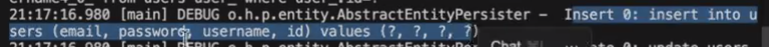

### Cambios de pom — el "kilombo" de Hibernate 5.1 + Java 9+

Por usar Hibernate 5.1 (con módulos `javax.persistence`) en Java 9+ (con JPMS), necesitás `--add-opens` para que la reflection funcione.

#### `pom.xml` padre — properties

```xml
<properties>
    <logback.version>1.5.6</logback.version>
    <org.hibernate.version>5.1.0.Final</org.hibernate.version>
    <org.hibernate.jpa.version>1.0.0.Final</org.hibernate.jpa.version>
    <javax.xml.version>2.3.1</javax.xml.version>
</properties>
```

#### `pom.xml` padre — dependencyManagement (agregar)

- `org.springframework:spring-orm`
- `org.hibernate:hibernate-core`
- `org.hibernate:hibernate-entitymanager`
- `org.hibernate.javax.persistence:hibernate-jpa-2.1-api`
- `javax.xml.bind:jaxb-api` (versión `${javax.xml.version}`)

#### `pom.xml` padre — pluginManagement (configurar surefire para JPMS)

```xml
<plugin>
    <groupId>org.apache.maven.plugins</groupId>
    <artifactId>maven-surefire-plugin</artifactId>
    <version>3.3.0</version>
    <configuration>
        <argLine>--add-opens java.base/java.lang=ALL-UNNAMED --add-opens java.persistence/javax.persistence=ALL-UNNAMED</argLine>
    </configuration>
</plugin>
```

#### `pom.xml` padre — Jetty con `--add-opens`

```xml
<plugin>
    <groupId>org.eclipse.jetty</groupId>
    <artifactId>jetty-maven-plugin</artifactId>
    <version>9.4.58.v20250814</version>
    <configuration>
        <jvmArgs>--add-opens java.base/java.lang=ALL-UNNAMED</jvmArgs>
        <scanIntervalSeconds>10</scanIntervalSeconds>
        <port>8080</port>
        <useTestScope>true</useTestScope>
    </configuration>
</plugin>
```

#### `persistence/pom.xml` — agregar

- `org.hibernate:hibernate-entitymanager`
- `javax.xml.bind:jaxb-api`

#### `webapp/pom.xml` — agregar

- `org.hibernate:hibernate-core`
- `org.hibernate.javax.persistence:hibernate-jpa-2.1-api`

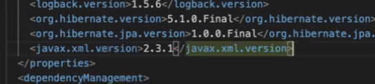

### Cambios en `TestConfiguration`

Hay que reemplazar el setup de JdbcTemplate por uno con `EntityManagerFactory`:

```java
@Configuration
@EnableTransactionManagement
public class TestConfiguration {

    @Bean
    public DataSource dataSource() {
        SimpleDriverDataSource ds = new SimpleDriverDataSource();
        ds.setDriverClass(JDBCDriver.class);
        ds.setUrl("jdbc:hsqldb:mem:paw;sql.syntax_pgs=true");   // sql.syntax_pgs=true habilita sintaxis PG
        ds.setUsername("ha");
        ds.setPassword("");
        return ds;
    }

    @Bean
    public LocalContainerEntityManagerFactoryBean entityManagerFactory() {
        LocalContainerEntityManagerFactoryBean factoryBean = new LocalContainerEntityManagerFactoryBean();
        factoryBean.setPackagesToScan("ar.edu.itba.paw.models");
        factoryBean.setDataSource(dataSource());

        JpaVendorAdapter vendorAdapter = new HibernateJpaVendorAdapter();
        factoryBean.setJpaVendorAdapter(vendorAdapter);

        Properties properties = new Properties();
        properties.setProperty("hibernate.hbm2ddl.auto", "update");
        properties.setProperty("hibernate.dialect", "org.hibernate.dialect.HSQLDialect");
        properties.setProperty("hibernate.show_sql", "true");
        properties.setProperty("format_sql", "true");

        factoryBean.setJpaProperties(properties);
        return factoryBean;
    }

    @Bean
    public PlatformTransactionManager transactionManager(EntityManagerFactory emf) {
        return new JpaTransactionManager(emf);
    }
}
```

> **Importante:** `jdbc:hsqldb:mem:paw;sql.syntax_pgs=true` — el flag de sintaxis PG en HSQLDB ayuda a que más SQL específico de PG funcione en tests.

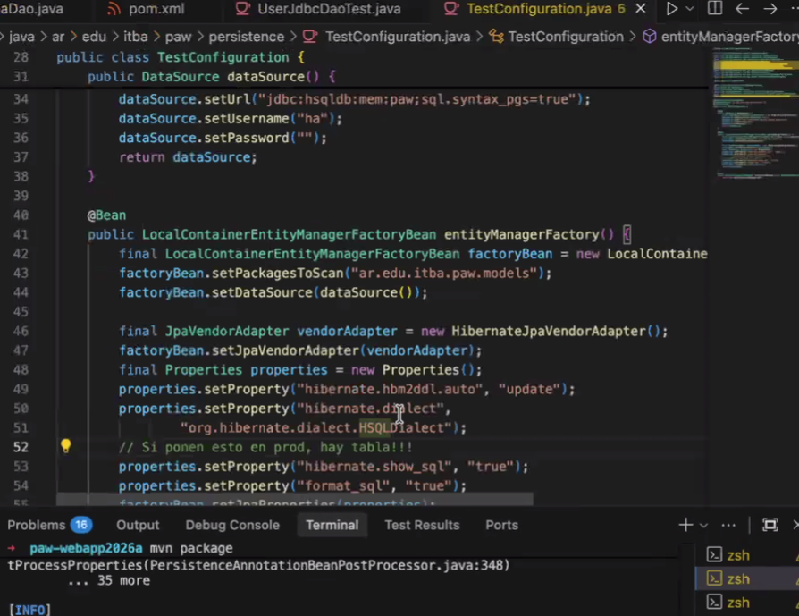

### Ejemplo: entidad nueva `Issue` desde cero

```java
@Entity
@Table(name = "issues")
public class Issue {

    @Id
    @GeneratedValue(strategy = GenerationType.SEQUENCE, generator = "issues_id_seq")
    @SequenceGenerator(name = "issues_id_seq", sequenceName = "issues_id_seq", allocationSize = 1)
    private Long id;

    @Column(nullable = false)
    private String title;

    @Column(columnDefinition = "TEXT")    // ← evita VARCHAR default
    private String description;

    @Column(name = "created_at", nullable = false)
    private LocalDateTime createdAt;

    /* package-private */ Issue() { /* For Hibernate */ }

    public Issue(String title, String description, LocalDateTime createdAt) { ... }
    // getters
}
```

Al levantar la app por primera vez con esta entidad y `hbm2ddl.auto = update`, Hibernate:

1. Crea la tabla:
   ```sql
   create table issues (
       id int8 not null,
       created_at timestamp not null,
       description TEXT,
       title varchar(255) not null,
       primary key (id)
   )
   ```
2. Crea la sequence: `create sequence issues_id_seq start 1 increment 1`

> Sin foreign keys y sin ser destructivo, anda bien.

#### Agregar columna nueva a entidad existente

Si después agrego `@Column(name = "resolved_at", nullable = true) private LocalDateTime resolvedAt;`:

> Cuando recompilo se da cuenta de que hay una inconsistencia en los tipos de datos y hace un `ALTER TABLE` para agregar la columna.

#### Reglas finales

> Mapear entidades es fácil. Entidades nuevas puedo usar los defaults libremente. Cuando mapeamos entidades **que ya existen** hay que ver que se estén usando los mismos nombres de atributos, columnas. **Tener cuidado: probarlo en la BD local antes**. Para los casos destructivos hay que seguir haciéndolo a mano, nosotros con **Flyway**.

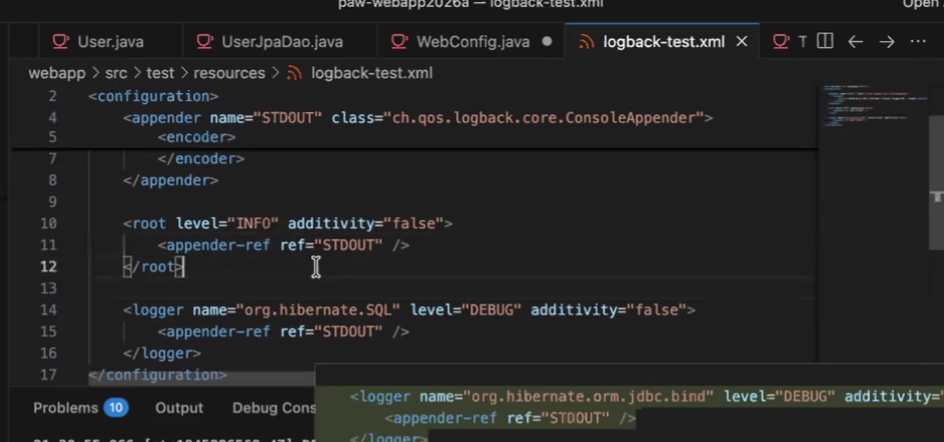

---

## Mapeo de imágenes a temas

Las 71 imágenes están en `raw/assets/notion-paw-images/` numeradas secuencialmente según orden de aparición en el PDF. Ranges aproximados:

| Imágenes | Tema |
|---|---|
| `img-000` a `img-006` | Cursor agent prompts (Allow Username Editing) |
| `img-007` a `img-014` | UserSecurity, WebAuthConfig con `access(...)` |
| `img-015` a `img-018` | Validation Groups en UserForm |
| `img-019` a `img-023` | profile.jsp, controller updateProfile, tests |
| `img-024` a `img-029` | Tests con `@ExtendWith`, ExceptionManagingAdvice |
| `img-030` a `img-040` | Hibernate intro: Friendship, friendIds, dependencias |
| `img-041` a `img-048` | EntityManagerFactory, JpaTransactionManager, UserJpaDao |
| `img-049` a `img-057` | TestConfiguration con JPA, cambios de pom (Java 9+ args) |
| `img-058` a `img-063` | Logback-test.xml para Hibernate, AST de queries |
| `img-064` a `img-070` | Entidad Issue desde cero, ALTER TABLE automático |
